# redis_cluster_tutorial

## 为什么要实现Redis Cluster

1. 主从复制不能实现高可用
2. 随着公司发展，用户数量增多，并发越来越多，业务需要更高的QPS，而主从复制中单机的QPS可能无法满足业务需求
3. 数据量的考虑，现有服务器内存不能满足业务数据的需要时，单纯向服务器添加内存不能达到要求，此时需要考虑分布式需求，把数据分不到不同服务器上
4. 网络流量需求，业务的流量已经超过服务器的网卡的上限值，可以考虑使用分布式来进行分流
5. 离线计算，需要中间环节缓冲等别的需求

## 数据分布

### 为什么要做数据分布
全量数据，单机Redis节点无法满足要求，按照分区规则把数据分到若干个子集当中

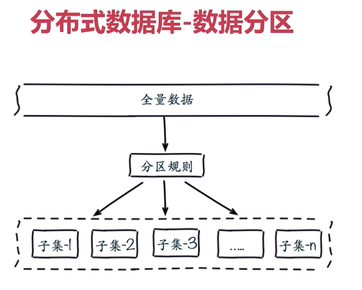

### 常用数据分布方式之顺序分布
比如：1到100个数字，要保存在3个节点上，按照顺序分区，把数据平均分配三个节点上，1号到33号数据保存到节点1上，34号到66号数据保存到节点2上，67号到100号数据保存到节点3上

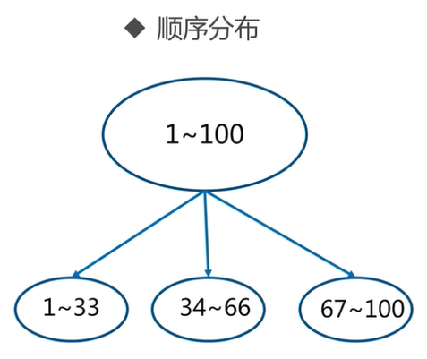

### 常用数据分布方式之哈希分布
例如1到100个数字，对每个数字进行哈希运算，然后对每个数的哈希结果除以节点数进行取余，余数为1则保存在第1个节点上，余数为2则保存在第2个节点上，余数为0则保存在第3个节点，这样可以保证数据被打散，同时保证数据分布较为均匀

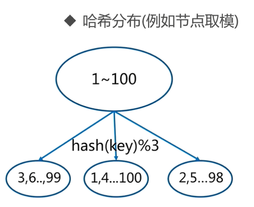

#### 节点取余分区
例如有100个数据，对每个数据进行hash运算之后，与节点数进行取余运算，根据余数不同保存在不同的节点上

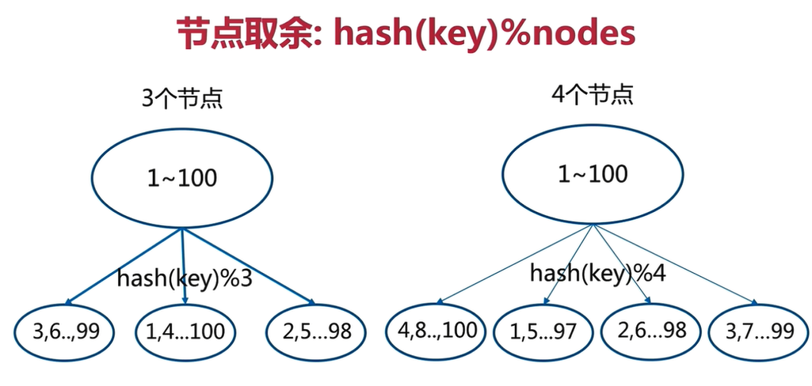

节点取余方式使非常简单的一种分区方式，但节点取余分区方式有一个问题，即当增加或减少节点时，原来节点中的80%的数据会进行迁移操作，对所有数据重新进行分布。节点取余分布方式建议使用多倍扩容的方式，例如以前用3个节点保存数据，扩容为比以前多一倍的节点即6个节点来保存数据，这样只需要迁移50%的数据。数据迁移之后，第一次无法从缓存中读取数据，必须先从数据库中读取数据，然后回写到缓存中，然后才能从缓存中读取迁移之后的数据。

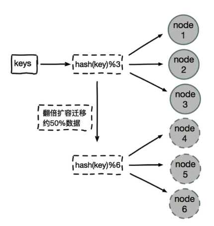

优点：客户端分片，配置简单，对数据进行哈希，然后取余

缺点：数据节点伸缩时，导致数据迁移；迁移数量和添加节点数据有关，建议翻倍扩容

#### 一致性哈希分区
原理：将所有的数据当做一个token环，token环中的数据范围是0到2的32次方。然后为每一个数据节点分配一个token范围值，这个节点就负责保存这个范围内的数据。

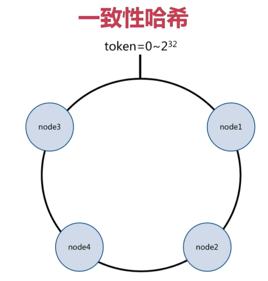

对每个key进行hash运算，被哈希后的结果在哪个token范围内，按顺时针去找最近的节点，这个key将会被保存在这个节点上。

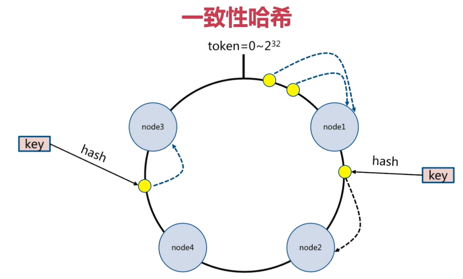

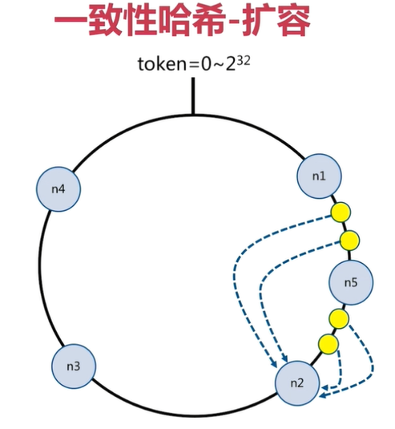

在上图中，有4个key被hash之后的值在n1节点和n2节点之间，按照顺时针规则，这4个key都会被保存在n2节点上，如果在n1节点和n2节点之间添加n5节点，当下次有key被hash之后的值在n1节点和n5节点之间，这些key就会被保存在n5节点上面了。在上面的例子里，添加n5节点之后，数据迁移会在n1节点和n2节点之间进行，n3节点和n4节点不受影响，数据迁移范围被缩小很多。同理，如果有1000个节点，此时添加一个节点，受影响的节点范围最多只有千分之二，一致性哈希一般用在节点比较多的时候。

优点：采用客户端分片方式，哈希+顺时针（优化取余）；节点伸缩时，只影响临近节点，但是还是有数据迁移。

缺点：翻倍伸缩，保证最小迁移数据和负载均衡。

#### 虚拟槽分区
虚拟槽分区是Redis Cluster采用的分区方式，预设虚拟槽，每个槽就相当于一个数字，有一定范围。每个槽映射一个数据子集，一般比节点数大。Redis Cluster中预设虚拟槽的范围是0到16383。


步骤：

1. 把16383槽按照节点数量进行平均分配，由节点进行管理
2. 对每个key按照CRC16规则进行hash运算
3. 把hash结果对16383进行取余
4. 把余数发送给Redis节点
5. 节点接收到数据，验证是否在自己管理的槽编号的范围。如果在自己管理的槽编号范围内，则把数据保存到数据槽中，然后返回执行结果；如果在自己管理的槽编号范围外，则会把数据发送给正确的节点，由正确的节点来把数据保存在对应的槽中。

需要注意的是：Redis Cluster的节点之间会共享消息，每个节点都会知道是哪个节点负责哪个范围内的数据槽。

虚拟槽分布方式中，由于每个节点管理一部分数据槽，数据保存到数据槽中。当节点扩容或者缩容时，对数据槽进行重新分配迁移即可，数据不会丢失。

虚拟槽分区特点：使用服务端管理节点、槽、数据，可以对数据打散，又可以保证数据分布均匀。

顺序分布与哈希分布的对比：

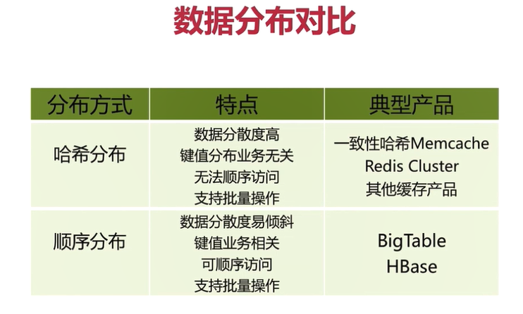

## Redis Cluster基本架构

### 节点
Redis Cluster是分布式架构：即Redis Cluster中邮多个节点，每个节点都负责进行数据读写操作，每个节点之间会进行通信。

### meet操作
节点之间会相互通信，meet操作是节点之间完成相互通信的基础，meet操作有一定的频率和规则。

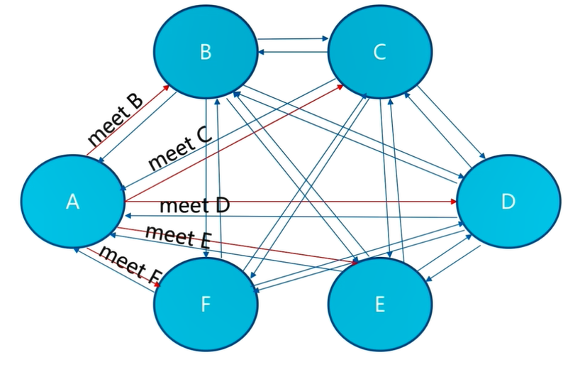

### 分配槽
把16383个槽平均分配给节点进行管理，每个节点只能对自己负责的槽进行读写操作。由于每个节点之间都彼此通信每个节点都知道另外节点负责管理的范围

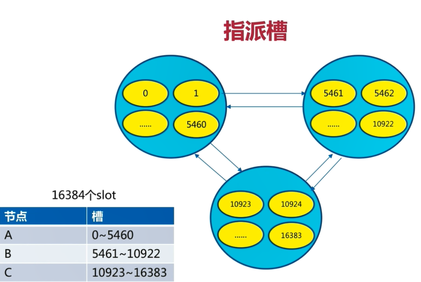

客户端访问任意节点时，对数据key按照CRC16规则进行hash运算，然后对运算结果对16383进行取作，如果余数在当前访问的节点管理的槽范围内，则直接返回对应的数据，如果不在当前节点负责管理的槽范围内，则会告诉客户端去哪个节点获取数据，由客户端去正确的节点获取数据。

### 复制
保证高可用，每个主节点都有一个从节点，当主节点故障，Cluster会按照规则实现主备的高可用性，对于节点来说，有一个配置项：cluster-enabled，即是否以集群模式启动。

### 客户端路由
#### moved重定向
1. 每个节点通过通信都会共享Redis Cluster中槽和集群中对应节点的关系
2. 客户端向Redis Cluster的任意节点发送命令，接收命令的节点会根据CRC16规则进行hash运算与16383取余，计算自己的槽和对应节点
3. 如果保存数据的槽被分配给当前节点，则去槽中执行命令，并把命令执行结果返回给客户端
4. 如果保存数据的槽不在当前节点的管理范围内，则向客户端返回moved重定向异常
5. 客户端接收到节点返回的结果，如果是moved异常，则从moved异常中获取目标节点的信息
6. 客户端向目标节点发送命令，获取命令执行结果

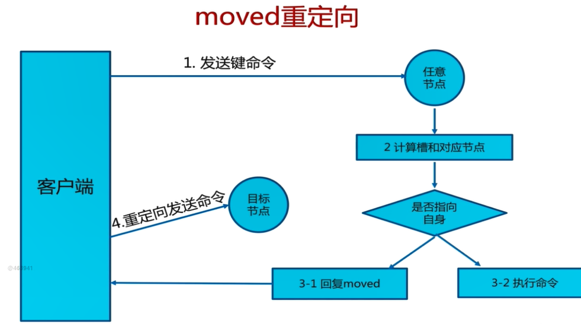

需要注意的是：客户端不会自动找到目标节点执行命令

槽命中：直接返回

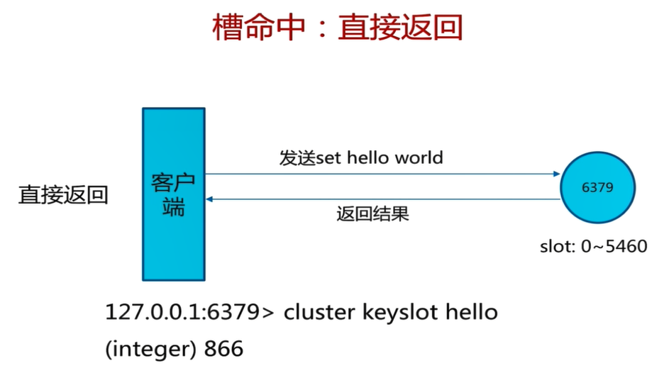

```shell
redis-cli -p 9002 cluster keyslot php
(integer) 866
```

槽不命中：moved异常

```shell
redis-cli -p 9002 cluster keyslot php
(integer) 9244
```

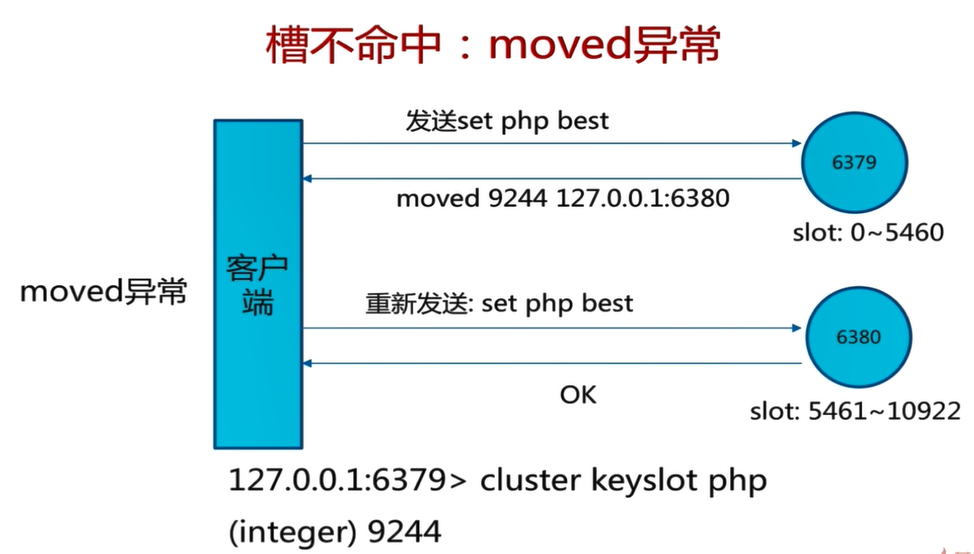

```shell
[root@mysql ~]# redis-cli -c -p 9002
127.0.0.1:9002> cluster keyslot hello
(integer) 866
127.0.0.1:9002> set hello world
-> Redirected to slot [866] located at 192.168.81.100:9003
OK
192.168.81.100:9003> cluster keyslot python
(integer) 7252
192.168.81.100:9003> set python best
-> Redirected to slot [7252] located at 192.168.81.101:9002
OK
192.168.81.101:9002> get python
"best"
192.168.81.101:9002> get hello
-> Redirected to slot [866] located at 192.168.81.100:9003
"world"
192.168.81.100:9003> exit
[root@mysql ~]# redis-cli -p 9002
127.0.0.1:9002> cluster keyslot python
(integer) 7252
127.0.0.1:9002> set python best
OK
127.0.0.1:9002> set hello world
(error) MOVED 866 192.168.81.100:9003
127.0.0.1:9002> exit
[root@mysql ~]# 
```

#### ask重定向

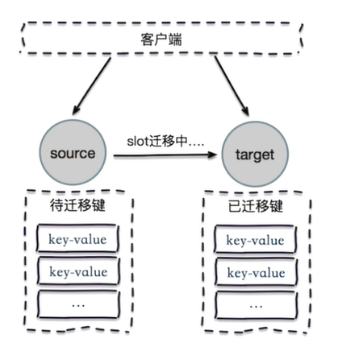

在对集群进行扩容和缩容时，需要对槽及槽中数据进行迁移。当客户端向某个节点发送命令，节点向客户端返回moved异常，告诉客户端数据对应的槽的节点信息。如果此时正在进行集群扩展或者缩空操作，当客户端向正确的节点发送命令时，槽及槽中数据已经被迁移到别的节点了，就会返回ask，这就是ask重定向机制。

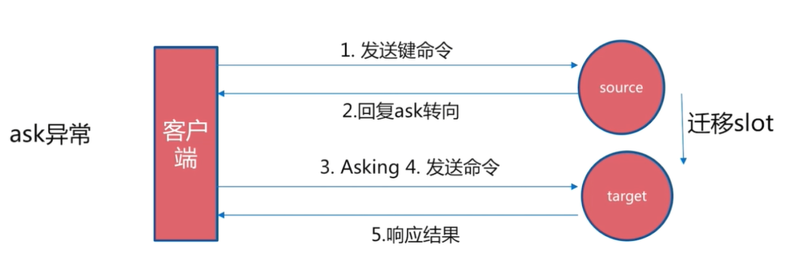

步骤：
1. 客户端向目标节点发送命令，目标节点中的槽已经迁移到别的节点上了，此时目标节点会返回ask转向给客户端
2. 客户端向新的节点发送asking命令给新的节点，然后再次向新节点发送命令
3. 新节点执行命令，把命令执行结果返回给客户端

moved异常与ask异常的相同点和不同点
- 两者都是客户端重定向
- moved异常：槽已经确定迁移，即槽已经不在当前节点
- ask异常：槽还在迁移中

#### smart智能客户端
使用智能客户端的首要目标：追求性能。从集群中选一个可运行节点，使用Cluster slots初始化槽和节点映射。将Cluster slots的结果映射在本地，为每个节点创建JedisPool，相当于为每个redis节点都设置一个JedisPool，然后就可以进行数据读写操作。

读写数据时的注意事项：
- 每个JedisPool中缓存了slot和节点node的关系
- key和slot的关系：对key进行CRC16规则进行hash后与16383取余得到的结果就是槽
- JedisCluster启动时，已经知道key，slot和node之间的关系，可以找到目标节点
- JedisCluster对膜表节点发送命令，目标节点直接相应给JedisCluster
- 如果JedisCluster与目标节点连接出错，则JedisCluster会知道连接的节点时一个错误的节点
- 此时JedisCluster会随机节点发送命令，随机节点返回moved异常给JedisCluster
- JedisCluster会重新初始化slot与node节点的缓存关系，然后向新的目标节点发送命令，目标命令执行并向JedisCluster响应
- 如果命令发送次数超过5次，则抛出异常"Too many cluster redirection!"

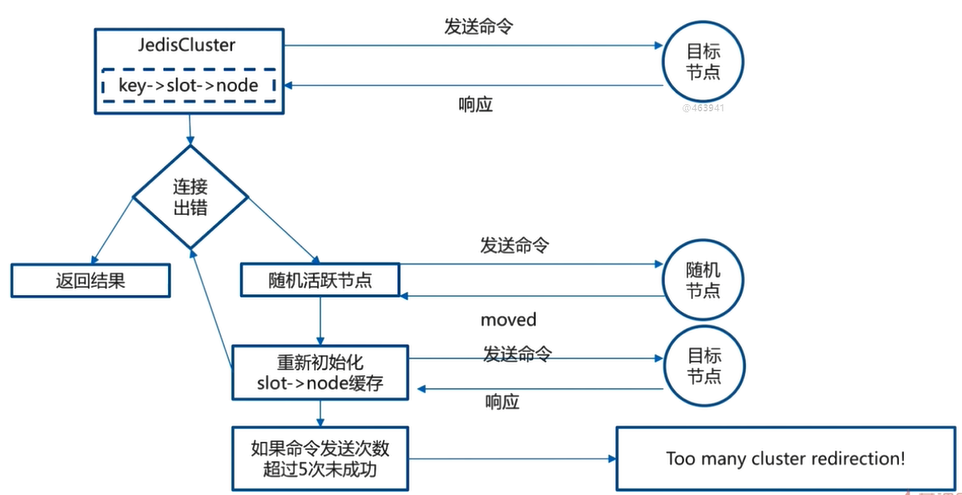

### 多节点命令实现
Redis Cluster不支持使用scan命令扫描所有节点，多节点命令就是在所有节点上都执行一条命令，批量操作优化。

#### 串行mget
定义for循环，遍历所有的key，分别取所有的Redis节点中获取值并进行汇总，简单但效率不高，需要n次网络时间。

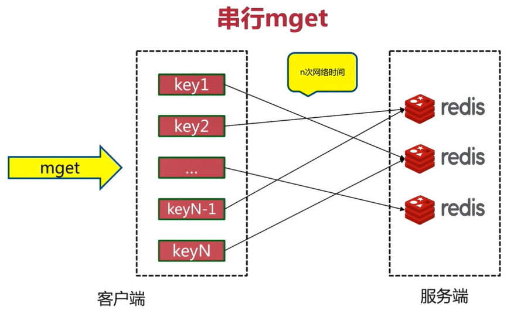

#### 串行IO
对串行mget进行优化，在客户端本地做内聚，对每个key进行CRC16hash，然后与16383取余，就可以知道哪个key对应的是哪个槽。本地已经缓存了槽与节点的对应关系，然后对key按节点进行分组，成立子集，然后使用pipeline把命令发送到对应的node，需要nodes次网络时间，大大减少了网络时间开销。

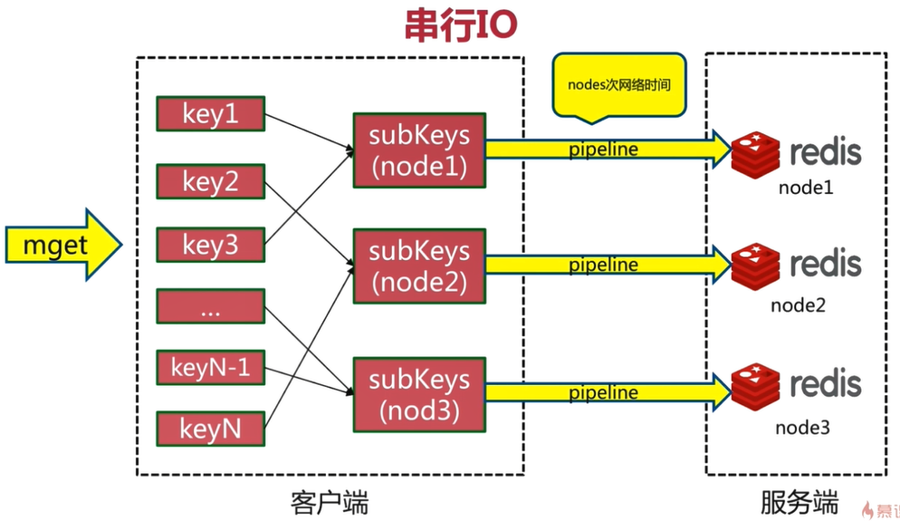

#### 并行IO
并行IO是对串行IO的一个优化，把key分组之后，根据节点数量启动对应的线程数，根据多线程模式并行向node节点请求数据，只需要1次网络时间

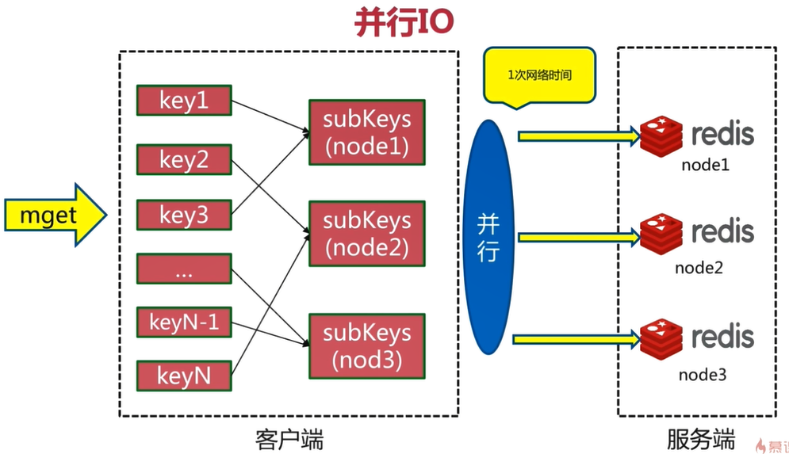

